## Subequivariant Graph Reinforcement Learning in 3D Environment ##
### ICML 2023 Oral
#### [[Project Page]](https://alpc91.github.io/SGRL/) [[Paper]](https://arxiv.org/abs/2305.18951)

[Runfa Chen](https://scholar.google.com/citations?user=WaeyhikAAAAJ&hl=en)<sup>1</sup>, [Jiaqi Han](https://scholar.google.com/citations?user=AKppgMAAAAAJ&hl=en)<sup>1</sup>, [Fuchun Sun](https://scholar.google.com/citations?user=DbviELoAAAAJ&hl=en)<sup>1 2</sup>, [Wenbing Huang](https://gsai.ruc.edu.cn/addons/teacher/index/info.html?user_id=31&ruccode=ADIIMVRnBzFXMFdnVTAIOw%3D%3D&ln=en)<sup>3 4</sup>

<sup>1</sup>Department of Computer Science and Technology, Institute for AI, BNRist Center, Tsinghua University, <sup>2</sup>THU-Bosch JCML Center, <sup>3</sup>Gaoling School of Artificial Intelligence, Renmin University of China, <sup>4</sup>Beijing Key Laboratory of Big Data Management and Analysis Methods<br/>


This is a PyTorch-based implementation of our [Subequivariant Graph Reinforcement Learning](https://alpc91.github.io/SGRL/). In this work, we introduce a new morphology-agnostic RL benchmark that extends the widely adopted 2D-Planar setting to 3D-SGRL, permitting significantly larger exploring space of the agents with arbitrary initial location and target direction. To learn a policy in this massive search space, we design SET, a novel model that preserves geometric symmetry by construction. Experimental results strongly support the necessity of encoding symmetry into the policy network and its wide applicability towards learning to navigate in various 3D environments. 

If you find this work useful in your research, please cite using the following BibTeX:

    @inproceedings{chen2023sgrl,
        title = {Subequivariant Graph Reinforcement Learning in 3D Environment},
        author = {Chen, Runfa and Han, Jiaqi and Sun, Fuchun and Huang, Wenbing},
        booktitle={International Conference on Machine Learning},
        year={2023},
        organization={PMLR}
        }

## Setup
### Requirements
- Python-3.8
- PyTorch-1.12
- CUDA-11.3
- [MuJoCo-210](https://www.roboti.us/index.html)


### Installing Dependencies
  ```Shell
  pip install --upgrade pip
  pip install -r requirements.txt
  ```

## Running Code
| Flags and Parameters  | Description |
| ------------- | ------------- |
| ``--env_name <STRING>``  | The name of the experiment project folder and the project name in wandb |
| ``--morphologies <STRING>``  | Find existing environments matching each keyword for training (e.g. walker, hopper, humanoid, cheetah, whh, cwhh, etc)  |
| ``--expID <STRING>``  | Experiment Name for creating saving directory  |
| ``--exp_path <STRING>``  | The directory path where the experimental results are saved  |
| ``--config_path <STRING>``  | The path to the configuration file  |
| ``--gpu <INT>``  | The GPU device ID (e.g., 0, 1, 2, 3, etc) |
| ``--custom_xml <PATH>``  | Path to custom `xml` file for training the morphology-agnostic policy.<br> When ``<PATH>`` is a file, train with that `xml` morphology only. <br> When ``<PATH>`` is a directory, train on all `xml` morphologies found in the directory |
| ``--actor_type <STRING>``  | Type of the actor to use (e.g., smp, swat, set, mlp, etc) |
| ``--critic_type <STRING>``  | Type of the critic to use (e.g., smp, swat, set, mlp, etc) |
| ``--seed <INT>``  | (Optional) Seed for Gym, PyTorch and Numpy  |

  
### Train with existing environment
- Train SET on ``3D_Hopper++`` (3 variants of hopper):
```Shell
cd src/
bash start.sh
  ```


## 3D-SGRL Environments

<table>
    <tbody>
        <tr>
            <td align="center" style="text-align:center" colspan=3><b>3D Hopper</b></td>
        </tr>
        <tr>
            <td align="center" style="text-align:center"><br>3d_hopper_3_shin</td>
            <td align="center" style="text-align:center">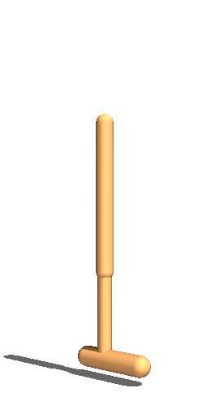<br>3d_hopper_4_lower_shin</td>
            <td align="center" style="text-align:center">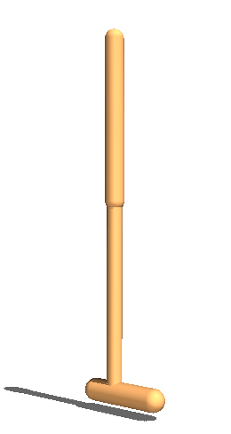<br>3d_hopper_5_full</td>
        </tr>
    </tbody>
</table>

<table>
    <tbody>
        <tr>
            <td align="center" style="text-align:center" colspan=6><b>3D Walker</b></td>
        </tr>
        <tr>
            <td align="center" style="text-align:center">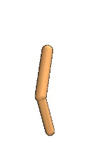<br>3d_walker_2_right_leg_left_knee</td>
            <td align="center" style="text-align:center">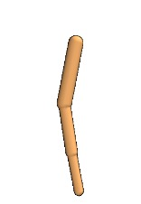<br>3d_walker_3_left_leg_right_foot</td>
            <td align="center" style="text-align:center">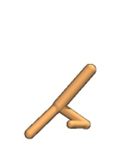<br>3d_walker_4_right_knee_left_foot</td>
            <td align="center" style="text-align:center">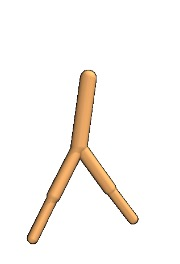<br>3d_walker_5_foot</td>
        </tr>
        <tr>
            <td align="center" style="text-align:center">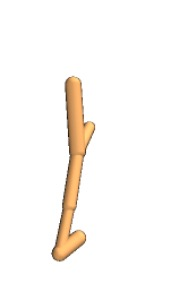<br>3d_walker_5_left_knee</td>
            <td align="center" style="text-align:center">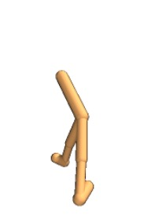<br>3d_walker_7_full</td>
            <td align="center" style="text-align:center">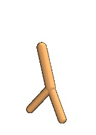<br>3d_walker_3_left_knee_right_knee</td>
            <td align="center" style="text-align:center">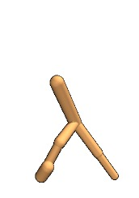<br>3d_walker_6_right_foot</td>
        </tr>
    </tbody>
</table>


<table>
    <tbody>
        <tr>
            <td align="center" style="text-align:center" colspan=4><b>3D Humanoid</b></td>
        </tr>
        <tr>
            <td align="center" style="text-align:center">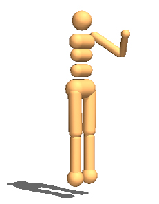<br>3d_humanoid_7_left_arm</td>
            <td align="center" style="text-align:center">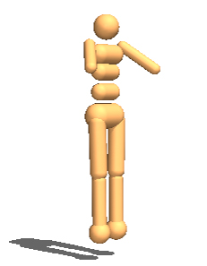<br>3d_humanoid_7_lower_arms</td>
            <td align="center" style="text-align:center">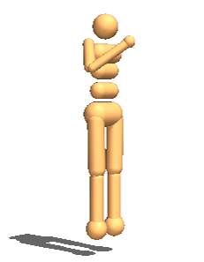<br>3d_humanoid_7_right_arm</td>
            <td align="center" style="text-align:center">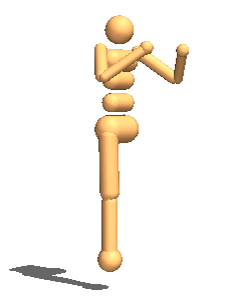<br>3d_humanoid_7_right_leg</td>
        </tr>
        <tr>
            <td align="center" style="text-align:center">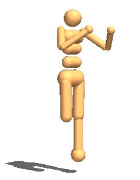<br>3d_humanoid_8_left_knee</td>
            <td align="center" style="text-align:center">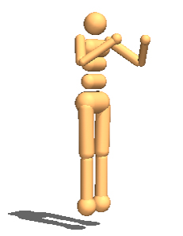<br>3d_humanoid_9_full</td>
            <td align="center" style="text-align:center">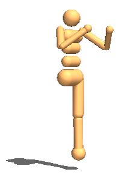<br>3d_humanoid_7_left_leg</td>
            <td align="center" style="text-align:center">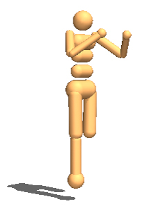<br>3d_humanoid_8_right_knee</td>
        </tr>
    </tbody>
</table>


<table>
    <tbody>
        <tr>
            <td align="center" style="text-align:center" colspan=5><b>3D Cheetah</b></td>
        </tr>
        <tr>
            <td align="center" style="text-align:center">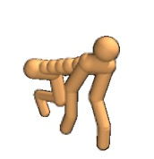<br>3d_cheetah_10_tail_leftbleg</td>
            <td align="center" style="text-align:center">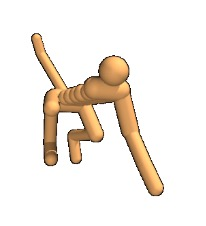<br>3d_cheetah_11_leftfleg</td>
            <td align="center" style="text-align:center">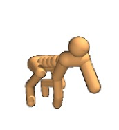<br>3d_cheetah_11_tail_rightfknee</td>
            <td align="center" style="text-align:center">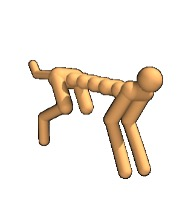<br>3d_cheetah_12_rightbknee</td>
            <td align="center" style="text-align:center">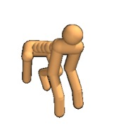<br>3d_cheetah_12_tail_leftbfoot</td>
        </tr>
        <tr>
            <td align="center" style="text-align:center">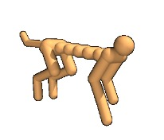<br>3d_cheetah_13_rightffoot</td>
            <td align="center" style="text-align:center">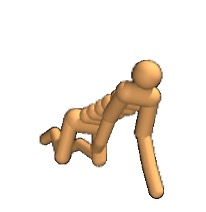<br>3d_cheetah_13_tail</td>
            <td align="center" style="text-align:center">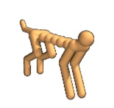<br>3d_cheetah_14_full</td>
            <td align="center" style="text-align:center">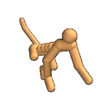<br>3d_cheetah_11_leftbkneen_rightffoot</td>
            <td align="center" style="text-align:center">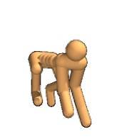<br>3d_cheetah_12_tail_leftffoot</td>
        </tr>
    </tbody>
</table>


For the results reported in the paper, the following agents are in the held-out set for the corresponding experiments:

- 3D_Walker++: 3d_walker_3_left_knee_right_knee, 3d_walker_6_right_foot
- 3D_Humanoid++: 3d_humanoid_7_left_leg, 3d_humanoid_8_right_knee
- 3D_Cheetah++: 3d_cheetah_11_leftbkneen_rightffoot, 3d_cheetah_12_tail_leftffoot

All other agents in the corresponding experiments are used for training.

## Acknowledgement
The RL code is based on this [open-source implementation](https://github.com/x35f/unstable_baselines) and the morphology-agnostic implementation is built on top of [SMP (Huang et al., ICML 2020)](https://github.com/huangwl18/modular-rl), [Amorpheus (Kurin et al., ICLR 2021)](https://github.com/yobibyte/amorpheus) and [SWAT (Hong et al., ICLR 2022)](https://github.com/sunghoonhong/SWAT) repository.